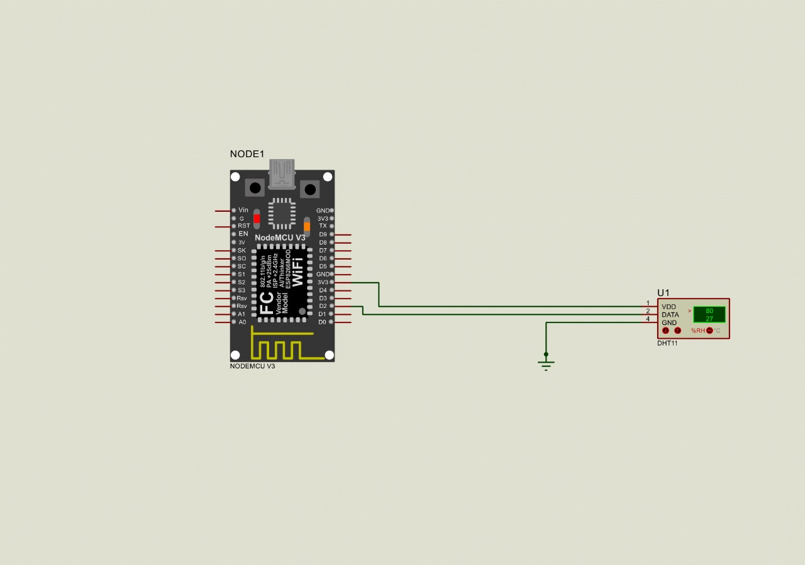

# Intefacing of DHT11 Sensor  with ESP8266 Node MCU

## Content
- 1.[Overview](#overview)
- 2.[Components Required](#components-reaquired)
- 3.[Project Flow](#project-flow)
- 4.[Circuit Diagram](#circuit-diagram)
- 5.[Summary](#summary)
  

## Overview
- This project is based on ESP8266 Node MCU

## Components Reaquired 
- ESP8266 Node MCU
- DHT11 sensor
- USB cable
- Jumper Wire
- Bread Board

 ## Project Flow
  ### 1.Hardware Setup
  #### i.Gather Components
 - ESP8266 NodeMCU
 - DHT11 Sensor 
 - Bread board & Jumper wire
 - USB cable

  #### ii.Hardware connectins
 - VCC of DHT11 sensor to 3.3V of NodeMCU
 - Gnd of DHT11 sensor to GND of NodeMCU
 - Connect Data pins of DHT11 sensor to digital pins on NodeMCU
 - connect the NodeMCU to computrer thruough usb cable

  ### 2.Software Setup
  #### i. install Required ide
 - Install the VS code 
 - Install the platfomIO extention
 - Creat the new project
 - select the ESP8266 NodeMCU board
 - Install  required libraries

     
   #### ii.Thingspeak  Setup
 - open Thingspeak
 - Creat new channel
 - select  no of fields required
 - Add api key and and chnnel no in source code

  #### iii.Wifi Setup
 - Turn on the Wifi
 - Add SSID and passward in source code

#### iv.Debug & Compile the Code
   - Dump the code in Node MCU
   - open the serial monitor to see the result
   - wait untill the the nodeMCU connects to the wifi

     
#### v.OUTPUT
- See output  on ThingSpeak channel feild
- https://api.thingspeak.com/channels/2588969/feeds.json?results=2

 ## Circuit Diagram
 

 ## Summary
 To interface a DHT11 with the ESP8266 NodeMCU and upload data to ThingSpeak, start by connecting the sensor VCC to the NodeMCU 3.3V pin, GND to GND, and Data to a digital pin Install the ESP8266WiFi and sensor libraries in the Platform IO. Write or upload code to read data from the sensor, connect to Wi-Fi, and send data to ThingSpeak using its API. Finally, compile and upload the code to the NodeMCU and monitor the uploaded data on the ThingSpeak channel.
